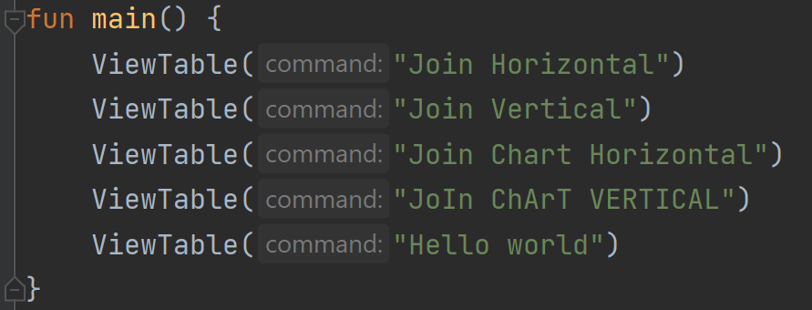
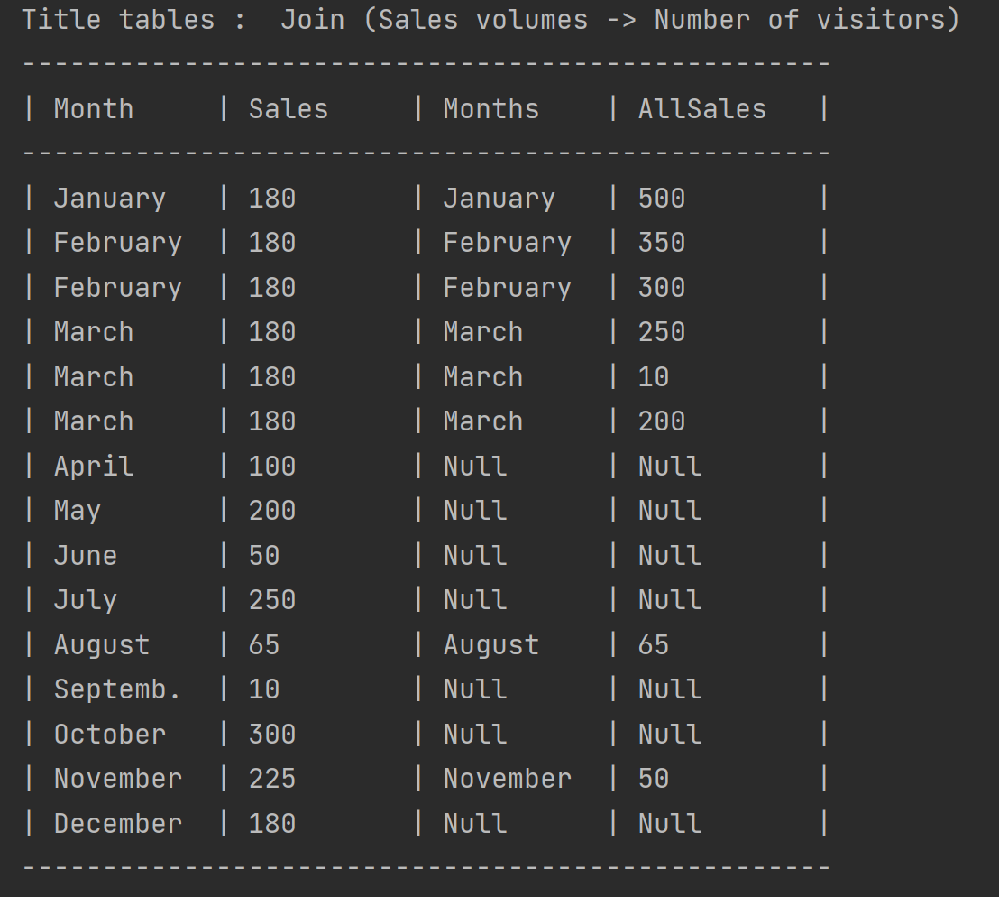
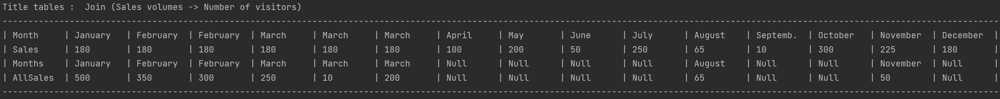
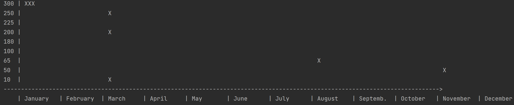
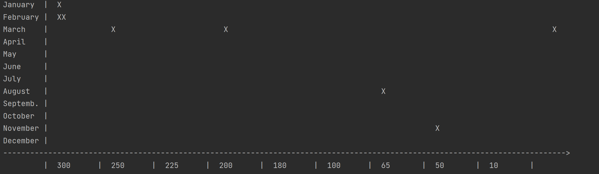
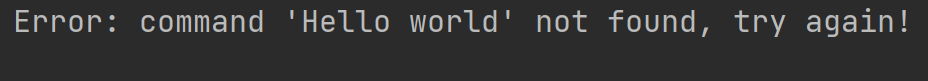

# DataTableView
Visualization of data in the form of tables and graphs

## Task

Several tables of numerical data are set. Each table consists of a name, a set of value names, and a set of their numeric non-negative values. There are also several views of these tables in the text console.

* Horizontal table

* Vertical table

* Horizontal chart

* Vertical chart

## Demonstration of the work

### Main function

### Horizontal table

### Vertical table

### Horizontal chart

### Vertical chart

### Invalid command

